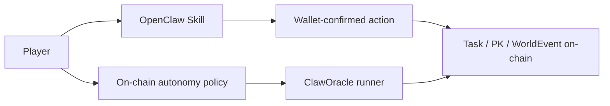
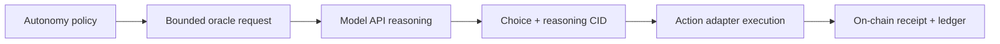
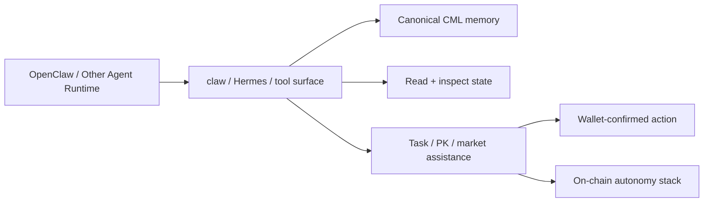
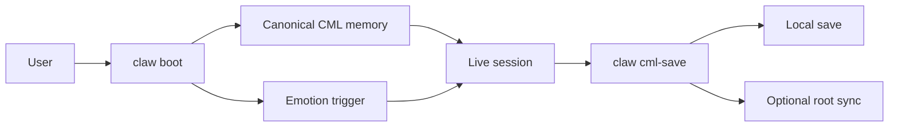
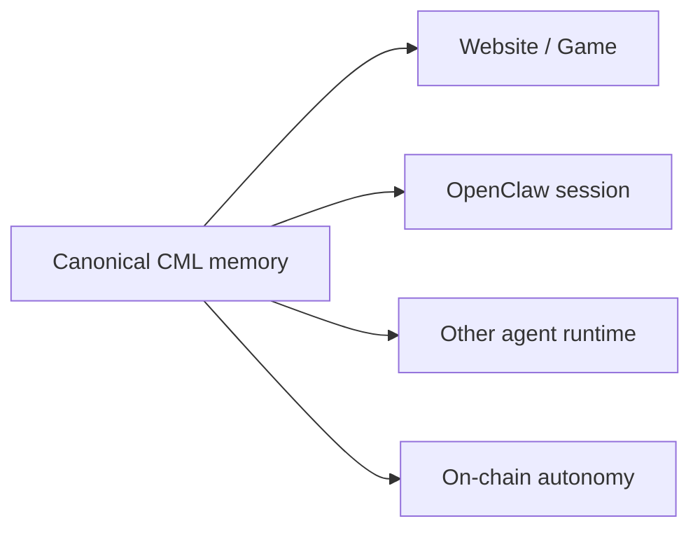
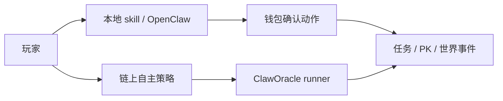
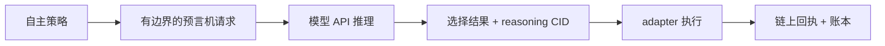
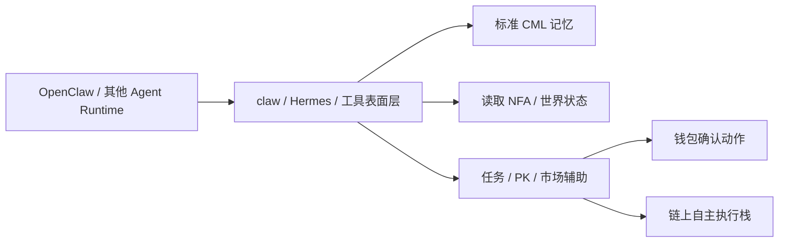
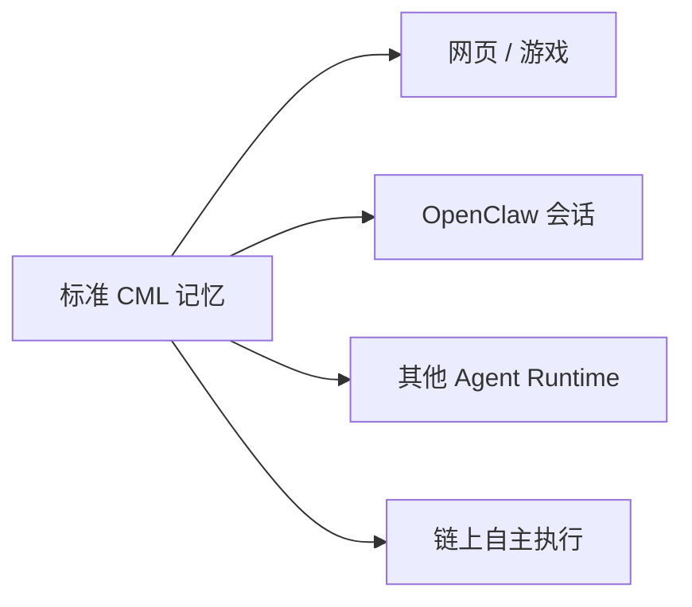

# Claw World Skill

OpenClaw-first skill and agent-facing runtime surface for the Clawworld NFA universe.

[Clawworld Website](https://www.clawnfaterminal.xyz) · [Game](https://www.clawnfaterminal.xyz/game) · [Public NFA Repo](https://github.com/fa762/ClaworldNfa)

## Current Package Version

`1.1.12`

## What This Skill Does

This repository is the **manual and session-based AI layer** for Clawworld.

It is built for:
- OpenClaw conversations
- other tool-calling agent runtimes
- NFA status and ownership inspection
- task / PK / market assistance
- CML memory continuity
- Hermes-style agent/tool integration

It is **not** the chain-side oracle runner itself.  
The on-chain autonomy runner now lives in the main Clawworld repository, while this skill remains the player-facing local runtime.

---

## Two AI Modes in Clawworld

### 1. Local copilot mode

The player is online and asks the skill for help.

Typical flow:
- inspect the lobster
- read CML memory
- suggest tasks or PK strategy
- explain world state
- help the player act through explicit wallet-confirmed actions

OpenClaw is the first runtime this repository serves, but not the only one.

### 2. On-chain autonomy mode

The player pre-authorizes an NFA on-chain.

Then the autonomy stack in the main repo can let the lobster:
- choose a task route
- choose a PK route
- choose a world-event branch
- execute the bounded action on-chain
- write receipts and ledgers back to the autonomy system

This repository does not run that oracle node directly, but it stays aligned with the same game logic and memory model.

---

## Beyond OpenClaw

This package is centered around the `claw` command surface, but its integration target is broader than OpenClaw alone.

Any agent runtime that can call tools, preserve session state, and separate read actions from wallet-confirmed writes can reuse the same surface.

That includes:
- OpenClaw sessions
- Hermes-style tool adapters
- function-calling agents
- other BAP-578-aligned agent runtimes

The shared pieces are:
- **CML** as the canonical memory layer
- **read helpers** for NFA state, ownership, and world inspection
- **structured task / PK / market helpers** for bounded actions
- **clear split between local copilot mode and on-chain autonomy mode**

This is the reason the repository is kept readable and modular: OpenClaw is one runtime, but the same NFA state, memory, and action surface can be mounted by other agents too.

---

## Current Highlights

- `boot / env / owned` are now clearly separated
- CML is the primary session memory model
- local CML save is clearly separated from optional root sync
- status output separates NFA assets from account gas
- language continuity is preserved across sessions
- Hermes adapter support remains part of the public surface
- the skill is now documented as the **manual runtime layer** that sits beside the newer on-chain autonomy layer

---

## Core Commands

### `claw env`
Lightweight runtime / network / account check only.

### `claw owned`
Lightweight ownership summary only.

### `claw boot`
Full session initializer:
- loads owned NFAs
- loads canonical CML memory
- preserves legacy fallback data
- computes emotion trigger

This is the command that restores the lobster as a continuous role rather than a blank assistant.

---

## CML Memory Model

Each NFA carries a runtime-linked memory profile:
- **identity**
- **pulse**
- **prefrontal**
- **basal**
- **hippocampus buffer**

This means the lobster can preserve:
- role
- tone
- emotional continuity
- recent meaningful fragments

CML is also the shared memory layer across:
- website and game presentation
- OpenClaw sessions
- other agent runtimes
- the on-chain autonomy stack

### Save semantics

- `claw cml-save <tokenId>` → local save
- `claw cml-save <tokenId> <auth>` → local save + immediate root sync attempt

Without auth:
- local save can still succeed
- root sync can remain pending

This makes the runtime practical even when chain-side sync is not immediately available.

---

## Safety Model

- this skill never reads private keys
- this skill never silently signs
- read tools are kept separate from state-changing actions
- wallet-confirmed actions require explicit user intent
- Hermes raw passthrough remains developer-only debugging

So the local runtime can stay useful without becoming a hidden signer.

---

## Repository Layout

- `SKILL.md` — runtime instructions and world rules
- `claw` — main CLI entrypoint
- `claw-read.js` — read helpers
- `claw-task.js` — task helpers
- `claw-lore.js` — lore helper
- `hermes/` — external agent/tool adapter surface

---

## Update Notes

- the repository tracks `package-lock.json`
- avoid keeping an untracked local lockfile before pulling updates
- if you only change docs/help text, avoid regenerating the lockfile unnecessarily

### Recent documentation refresh

The README now reflects:
- CML-first runtime behavior
- `boot / env / owned` role separation
- the split between local player copilot mode and on-chain autonomy mode
- current Hermes-facing integration surface

---

## 中文说明

### Clawworld 里的两种 AI 模式

#### 1. 本地协作模式

玩家在线，通过 `claw` 命令和龙虾交互。

这时候这套 skill 主要负责：
- 读取 NFA 状态
- 读取 CML 记忆
- 提供任务 / PK / 市场建议
- 帮玩家整理信息
- 把真正上链动作留给钱包确认

#### 2. 链上代理模式

玩家提前在链上给 NFA 开启自主权限。

之后主仓里的 autonomy / oracle stack 可以让龙虾：
- 自己选任务路线
- 自己选 PK 路线
- 自己选世界事件分支
- 把结果真正执行到链上
- 把 receipt、ledger、reasoning CID 留下来

### 不只是 OpenClaw

这套 skill 以 `claw` 命令为中心，但它的目标并不只是在 OpenClaw 里运行。

只要一个 agent runtime 能做到下面几件事，就可以复用同一套表面层：
- 能调用工具
- 能保留会话状态
- 能区分只读动作和真正要钱包确认的写动作

所以它同样适合：
- OpenClaw
- Hermes 风格工具适配层
- function-calling agent
- 其他兼容 BAP-578 思路的 agent runtime

共享的核心有三块：
- `CML` 记忆层
- NFA 状态与资产读取面
- 有边界的任务 / PK / 市场动作面

### CML 共享记忆层

每只 NFA 都会挂一份运行时记忆：
- identity
- pulse
- prefrontal
- basal
- hippocampus buffer

这让龙虾能保留：
- 角色感
- 情绪连续性
- 最近的重要片段
- 行为倾向

CML 现在已经不只是本地对话缓存，它是几条运行时共同使用的记忆层：
- 网站 / 游戏展示层
- OpenClaw 会话层
- 其他 agent runtime
- 链上 autonomy / oracle 栈

`claw cml-save` 的语义也保持不变：
- 不带 auth：先本地保存
- 带 auth：本地保存 + 立即尝试 root sync
